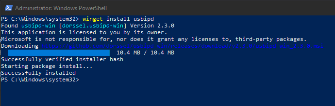
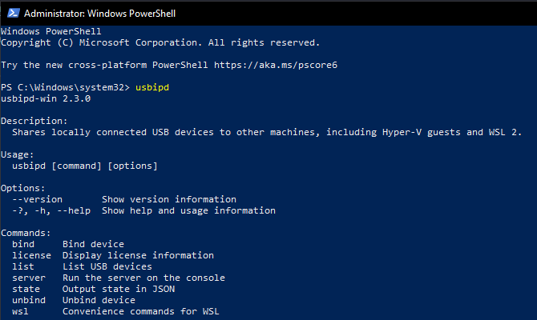
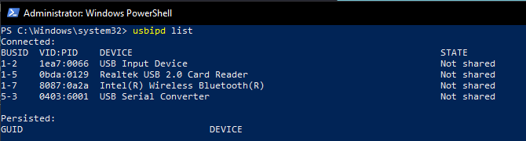
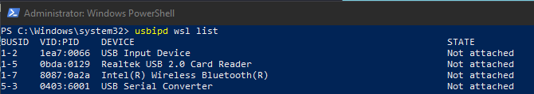
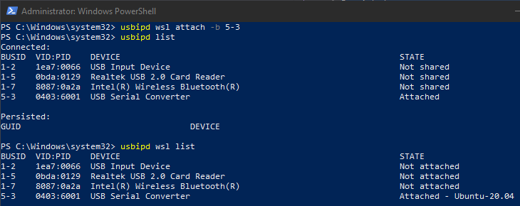
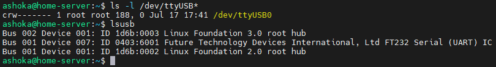
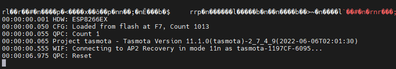

Saya setiap harinya menggunakan laptop dengan sistem operasi linux. Namun kadang menggunakan PC dirumah yang menggunakan OS Windows, tapi juga saya pasang WSL2 karena sudah terbiasa dengan lingkungan linux, seperti untuk kebutuhan ssh dan lainnya. Suatu saat saya ingin menggunakan `esptool` untuk flash firmware ESP8266 ataupun mau monitoring serial console nya di PC Windows, ketika saya pasang USB to Serial FTDI tidak muncul di list `ls -l /dev/ttyUSB*` maupun `lsusb` pada WSL2.


## Install usbipd

Kemudian saya cari cari apakah bisa USB TTL di Windows bisa diakses di WSL2, dan menemukan [usbipd-win](https://github.com/dorssel/usbipd-win). Cara install nya gampang, buka Powershell sebagai Administrator, kemudian jalankan `winget install usbipd`, proses instalasi akan langsung berjalan, pastikan koneksi internet stabil.



Setelah proses install selesai, tutup window powershell dan buka lagi sebagai Administrator. Jalankan perintah `usbipd` jika muncul tampilan berikut berarti usbipd sudah terinstall.



## Menggunakan aplikasi usbipd

Dari gambar diatas sudah ditampilkan dengan jelas daftar perintah juga keterangan dari perintah tersebut





Perhatikan pada bagian perangkat USB Serial Converter, dari kedua perintah diatas menampilkan status usb nya **Not shared** dan **Not attached** ini menandakan USB serialnya belum terhubung ke WSL. Untuk menghubungkan USB Serial Converter agar bisa diakses melalui WSL, jalankan perintah `usbipd wsl attach -b <BUSID>`. BUSID adalah Bus ID yang ditampilkan pada list perangkat, untuk kasus ini USB Serial memiliki Bus ID `5-3`.

## Error attach

Jika terjadi error ketika menjalankan perintah attash, seperti error birikut ini:

```powershell
usbipd: error: WSL 'usbip' client not correctly installed. See https://github.com/dorssel/usbipd-win/wiki/WSL-support for the latest instructions.
```

Solusinya sudah ditunjukan pada keterangan errornya, kunjungi link yang tertera, ikuti petunjuk selanjutnya. Kurang lebih jalankan perintah seperti dibawah ini:

```bash
# jalankan perintah ini di WSL
sudo apt install linux-tools-virtual hwdata 
sudo update-alternatives --install /usr/local/bin/usbip usbip `ls /usr/lib/linux-tools/*/usbip | tail -n1` 20
```

Setelah sukses menjalankan perintah diatas, jalankan lagi perintah `usbipd wsl attach -b 5-3` di Powershell. Status USB Serial sudah **Attached**.



## Cek list usb wsl

Jika usb sudah di hubungkan menggunakan aplikasi `usbipd`, kemudian tes dari sisi WSL apakah USB Serial sudah terdeteksi.



## Test monitoring serial console ESP01

Setelah menghubungkan ESP01 dengan FTDI Serial dan sudah terdeteksi oleh WSL, saatnya tes monitoring serial console ESP01 melalui terminal pada WSL. Untuk monitoring serial console ini saya menggunakan aplikasi `screen`, dan sebagai catatan `/dev/ttyUSB*` pada WSL owner dan group nya adalah `root`, maka untuk menjalankan perintah screen harus diawali dengan sudo.

```bash
# /dev/ttyUSB0 adalah lokasi device usb serial
# 115200 adalah baudrate, nilai bisa disesuaikan
sudo screen /dev/ttyUSB0 115200
```

Setelah menjalankan perintah diatas tampilan akan blank, tunggu beberapa saat akan muncul log serial console. Jika tidak muncul apapun lakukan perintah reset pada device. Jika muncul log tampilan karakter tidak jelas, kemungkinan perlu merubah  nilai baudrate.


