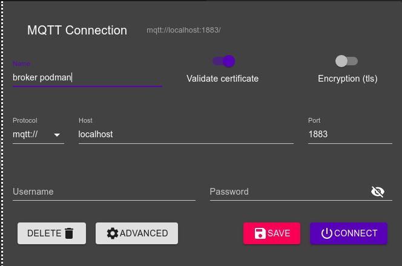
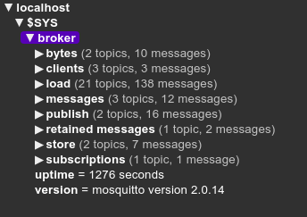

Berikut ini langkah untuk membuat mqtt broker menggunakan eclipse mosquitto di podman

## Membuat container
- Masuk menu podman container
- Create container, isi field berikut
  - **Name** : mqtt
  - **Owner** : User:ashoka
  - **Image** : docker.io/library/eclipse-mosquitto
  - **Command** : /usr/sbin/mosquitto -c /mosquitto/config/mosquitto.conf [tanpa terminal]
  - **Port mapping**:
      - host:1883 container 1883 tcp
  - **Volume**:
       - /home/ashoka/Apps/podman/mqtt/config -> /mosquitto/config writable private
       - /home/ashoka/Apps/podman/mqtt/log -> /mosquitto/log writable private
       - /home/ashoka/Apps/podman/mqtt/data -> /mosquitto/data writable private

- Buat file dan folder berikut:
```
./mqtt/
├── config
│   └── mosquitto.conf
├── data
└── log
```

file ~/A/podman►cat mqtt/config/mosquitto.conf
``` 
allow_anonymous true
persistence true
persistence_location /mosquitto/data/
log_dest file /mosquitto/log/mosquitto.log

listener 1883
```

- **Create and run**

## Test broker tanpa user
Jika sudah berhasil running, coba test menggunakan aplikasi MQTT-Explorer atau aplikasi lain. 
Isikan parameter berikut:
- Name: **broker podman**
- Protocol: **mqtt://**
- Host: **localhost**
- Port: **1883**


 

Klik **Save** kemudian klik **Connect**. 

Jika berhasil maka akan muncul tampilan berikut:

 

## Membuat user
Pada konfigurasi mosquitto sebelumnya itu membolehkan/mengizinkan semua orang terhubung ke mqtt broker tanpa menggunakan username dan password. Agar tidak semua orang dapat memantau aktivitas pada broker kita, perlu dibuatkan user dan password untuk membatasi akses ke broker. Berikut ini langkah-langkah untuk membuat user dan password untuk mqtt broker.
- Masuk ke console container mqtt
- Jalankan perintah `mosquitto_passwd -c /mosquitto/config/passwd ashoka`
- Akan muncul prompt untuk memasukkan password, masukkan password
- Update file `mosquitto.conf`, untuk disable anonim dan tambahkan password file
```conf
# file /mosquitto/config/mosquitto.conf

# disable user anonim
allow_anonymous false
                                     
# set lokasi penyimpanan file password
password_file /mosquitto/config/passwd
```
- Restart container

Setelah di restart coba konek ke broker dengan tanpa menggunakan user dan password, maka akan ada peringatan ***Connection refused: Not authorized***. Kemudian coba konek menggunakan user dan password yang tadi sudah dibuat, maka akan berhasil terhubung ke broker.