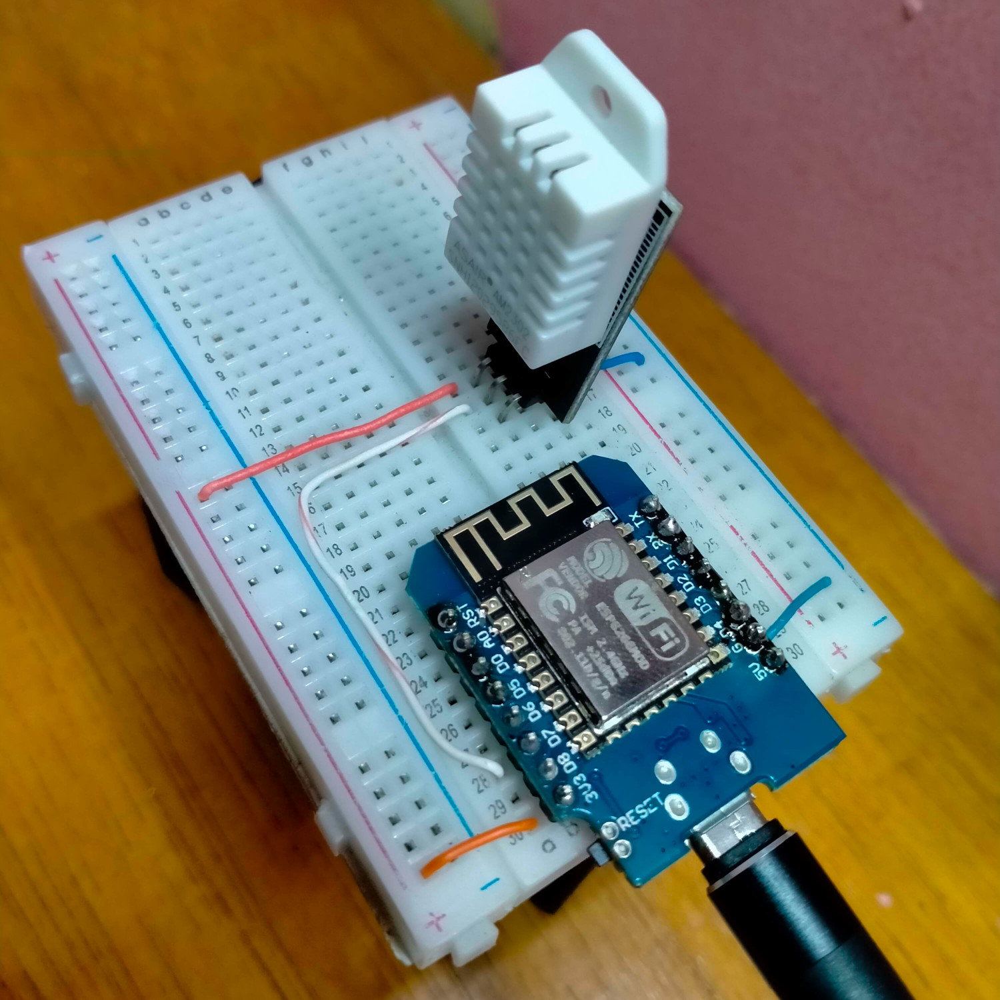
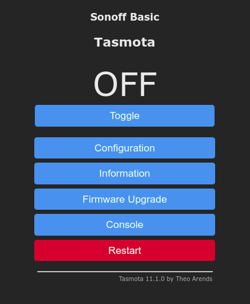
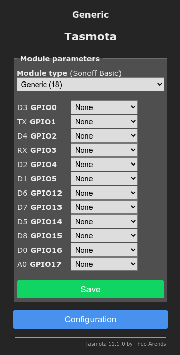
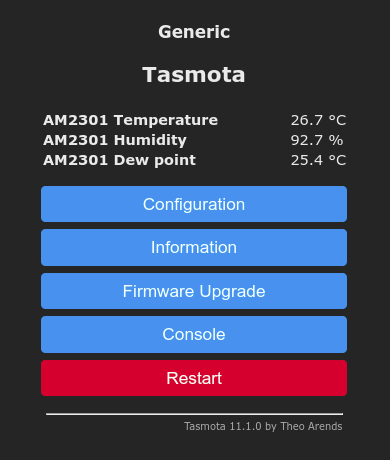
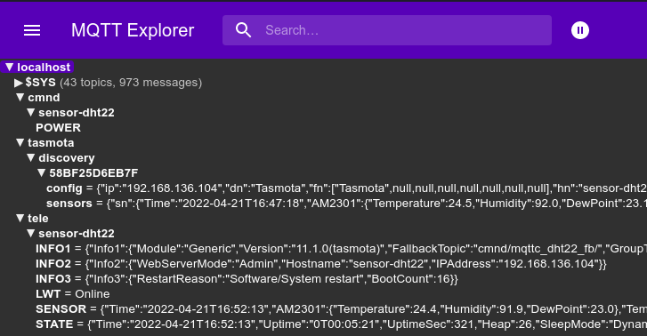

Membuat rangkaian IOT untuk memonitoring suhu dan kelembaban tanpa perlu repot koding dan kompilasi kode.

## Persiapan alat dan bahan

Beberapa alat dan bahan yang perlu disipkan adalah sebagai berikut:
- **Breadboard**, untuk memasang rangkaian
- **Wemos D1 mini** (atau modul esp8266 lainnya)
- **Sensor DHT22**, sensor suhu dan kelembaban
- **Kabel jumper**, untuk menghubungkan rangkaian tentunya
- **Kabel data**, untuk flash firmware dan suplai power
- Dan tentunya membutuhkan **Laptop/PC** dan **koneksi internet**

## Skema rangkaian

Rangkaian sederhanyanya seperti ini:
- Kaki pin negatif (-) pada dht22 dihubungkan ke ground pada wemos
- Kaki pin positif (+) pada dht22 dihubungkan ke 3V pada wemos
- Kaki pin output (data) pada dht22 dihubungkan ke D7 pada wemos
- Kabel data dihubungkan ke wemos dan laptop

 

## Flash firmware

Firmware yang akan digunakan adalah [Tasmota](https://tasmota.github.io/docs/About/). Tasmota adalah firmware open source untuk chipset berbasis Espressif (ESPxxx). Berikut ini langkah-langkah untuk flash tasmota ke wemos:
- Buka [Tasmota Web Installer](https://tasmota.github.io/install/)
- Hubungkan wemos ke laptop dengan kabel data
- Pilih versi firmware, untuk saat ini versi **Release Tasmota (english)**
- Klik **Connect** untuk memilih serial port dari wemos
- Pilih install release tasmota
- Check erase device, kemudian klik Install, ditunggu prosesnya, jangan pindah kemana mana 
- Setelah install selesai, klik next untuk menghubungkan tasmota ke wifi
- Hubungkan ke wifi, kemudian klik visit device, akan muncul tampilan awal tasmota

 

## Konfigurasi tasmota

### Konfigurasi modul
Hal pertama yang perlu di sesuaikan adalah modul pada tasmota, karena kali ini menggunakan wemos maka konfigurasinya seperti ini:
- Pilih menu Configuration > Configure Module > pilih module type **Generic (18)** > Save
- Tunggu hingga tasmota restart dan kembali ke halaman awal
- Pilih menu Configuration > Configure Module, maka tampilan module akan seperti ini

 

### Sesuaikan pin dengan rangkaian
Setelah modul generic diaktifkan, selanjutnya kita perlu menyesuaikan pin modul sesuai [skema rangkaian](#skema-rangkaian). Karena hanya ada satu komponen yang terhubung, jadi hanya satu pin saja yang perlu disesuaikan yaitu pin D7 untuk output dari sensor DHT22. Untuk sensor DHT22 di tasmota kita bisa menggunakan nama sensor **AM2301**. Info lebih lanjut tentang komponen gpio [disini](https://tasmota.github.io/docs/Components/#gpios);
- Pada tampilah halaman module, temukan pin **D7 GPIO13**
- Klik dropdown dan pilih **AM2301**
- (opsional) pada pin **D4 GPIO2** pilih dropdown **LedLink** untuk menyalakan led built-in sebagai indikator status
- Klik **Save**, tunggu hingga restart dan kembali ke halaman awal
- Jika rangkaian sudah benar maka di halaman depan akan muncul deteksi dari sensor, dan led built-in akan menyala/berkedip

 

Mudah sekali kan ? tanpa perlu menulis kode dan kompilasi kode menggunakan arduino IDE, kita bisa membuat rangkaian sensor dht22 dengan wemos d1 mini untuk monitoring suhu dan kelembaban. Hanya perlu menyesuaikan konfigurasi melalui tampilan antarmuka di web.

### Konfigurasi Wifi
Dengan firmware tasmota kita bisa menambahkan dua koneksi wifi, jadi misal wifi1 tidak tersedia maka akan konek ke wifi2 secara otomatis. Untuk konfigurasi wifi:
- Pilih menu Configuration > Configure Wifi
- Masukkan nama wifi dan password yang akan digunakan
- Isikan Hostname, untuk identifikasi nama host di jaringan, misal **sensor-dht22**
- Klik **Save**, tunggu hingga restart dan kembali ke halaman awal

### Konfigurasi MQTT
MQTT adalah protokol yang biasa digunakan perangkat IOT untuk mengirim(publish) dan/atau menerima(subscribe) data. Untuk menggunakan mqtt kita harus menyiapkan dulu mqtt brokernya. Dalam postingan sebelumnya sudah ada cara untuk membuat container [mqtt broker](/id/p/podman-mqtt-broker/). Sebelum menghubungkan tasmota ke mqtt broker, kita test dulu mqtt brokernya menggunakan aplikasi MQTT-Explorer. Jika sudah terhubung, selanjutnya menghubungkan tasmota ke mqtt broker:
- Pilih menu Configuration > Configure MQTT
- **Host**, diisi dengan alamat IP/domain host mqtt broker, dalam contoh kali ini adalah ip lokal **192.168.136.123**
- **Port**, diisi dengan port default mqtt **1883**
- **Client**, bisa di biarkan secara default atau diisi dengan, misal **mqttc_dht22**, nama ini akan muncul di log mqtt broker ketika sudah terhubung.
- **User dan Password** diisikan dengan user password yang digunakan untuk login ke mqtt broker, dalam contoh kali ini adalah user **ashoka** dan password **haha**
- Untuk **Topic**, kita samakan dengan nama Hostname saja, diisi dengan **%hostname%**
- **Full topic**, biarkan default
- Klik **Save**, tunggu hingga restart dan kembali ke halaman awal
- Jika koneksi ke mqtt broker berhasil maka akan muncul 3 topic baru yang tampil di mqtt explorer yaitu **cmnd, tasmota, tele**. Dan di dalam sub topic nya muncul nama device kita yang diberi nama sesuai nama hostname tadi, **sensor-dht22**.

